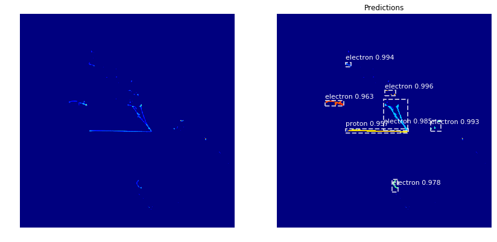

# Mask R-CNN for LArTPC 

This is an implementation of [Mask R-CNN by matterport](https://github.com/matterport/Mask_RCNN) on Liquid Argon Time Projection Chamber (LArTPC) data. The goal is to apply instance segmentaion for particle identification.

